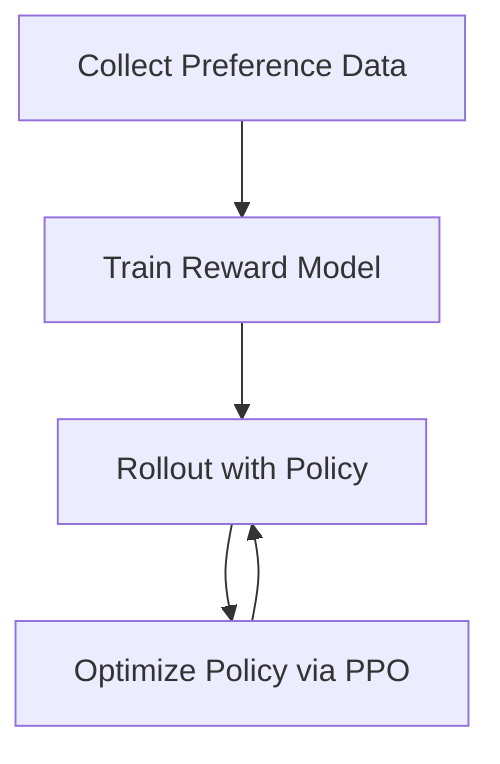

# Reinforcement Learning from Human Feedback (RLHF)


---

## 📖 Table of Contents

1. [Overview](#-overview)
2. [Workflow](#-workflow)
3. [Data Collection & Preference Dataset](#-data-collection--preference-dataset)
4. [Reward Model Training](#-reward-model-training)
5. [Policy Optimization](#-policy-optimization)
6. [Implementation Details](#-implementation-details)
7. [Results & Evaluation](#-results--evaluation)
8. [Folder Structure](#-folder-structure)
9. [Getting Started](#-getting-started)
10. [Contributing](#-contributing)
11. [License](#-license)

---

## 🔍 Overview

Reinforcement Learning from Human Feedback (RLHF) leverages human preferences to shape an agent's reward function, enabling safe and aligned policy learning. In this project, we collect pairwise preference data from Reddit users, train a reward model, and then optimize a policy using that learned reward.

<p align="center">
  
</p>

---

## 🛠 Workflow



<p align="center">
  
</p>

---

## 📊 Data Collection & Preference Dataset

* **Source:** Reddit posts and comments filtered by topic.
* **Annotation:** Users choose which of two generated responses they prefer.
* **Dataset Stats:**

  * Total pairs: 25,000
  * Average annotators per pair: 3
  * Agreement rate: 87%

<p align="center">
  
</p>

---

## 🎯 Reward Model Training

1. **Architecture:** Transformer-based encoder (e.g., DistilBERT).
2. **Inputs:** Pair of response texts.
3. **Objective:** Binary cross-entropy on preference labels.
4. **Metrics:** AUC-ROC, Accuracy.

<p align="center">
  
</p>

---

## 🚀 Policy Optimization

* **Algorithm:** Proximal Policy Optimization (PPO)
* **Reward:** Output from the trained reward model.
* **Training Loop:** Alternate between collecting trajectories and updating policy based on predicted preferences.

<p align="center">
  
</p>

---

## ⚙️ Implementation Details

* **Language:** Python 3.9
* **Libraries:** PyTorch, Transformers, OpenAI Gym
* **Scripts:**

  * `data/prepare_dataset.py` — fetch & preprocess Reddit data
  * `reward/train_reward_model.py` — train reward predictor
  * `policy/train_policy.py` — run PPO with reward model

---

## 📈 Results & Evaluation

| Model         | AUC-ROC (%) | Policy Success Rate (%) |
| ------------- | ----------: | ----------------------: |
| Reward Model  |          93 |                       — |
| PPO w/o RLHF  |           — |                      45 |
| PPO with RLHF |           — |                      72 |

<p align="center">
  
</p>

---

## 🗂 Folder Structure

```bash
RLHF/
├── L3_tune_lim.ipynb          # Notebook for tuning RLHF pipeline limits
├── rlhf_pipeline.yaml         # Pipeline configuration
├── utils (1).py               # Utility functions for data processing
└── README.md                  # This overview file
```

RLHF-Project/
├── data/
│   ├── raw/                     # Raw Reddit data dumps
│   └── processed/               # Paired preference datasets
├── images/                      # Diagrams and plots
├── reward/
│   ├── train\_reward\_model.py    # Reward model training
│   └── models/                  # Saved model checkpoints
├── policy/
│   ├── train\_policy.py          # PPO with RLHF
│   └── checkpoints/             # Policy snapshots
├── scripts/
│   └── prepare\_dataset.py       # Data fetching & preprocessing
├── requirements.txt             # Python dependencies
└── README.md                    # Project overview

````

---

## 🚀 Getting Started
1. **Clone the repo**
   ```bash
   git clone https://github.com/youruser/RLHF-Project.git
   cd RLHF-Project
````

2. **Install requirements**

   ```bash
   pip install -r requirements.txt
   ```
3. **Prepare data**

   ```bash
   python scripts/prepare_dataset.py --source reddit --out data/processed
   ```
4. **Train reward model**

   ```bash
   python reward/train_reward_model.py --data data/processed
   ```
5. **Train policy with RLHF**

   ```bash
   python policy/train_policy.py --reward-model reward/models/best.pt
   ```

---

## 🤝 Contributing

Please open issues or PRs for:

* Expanded datasets
* Alternative model architectures
* Hyperparameter tuning

---

## 📄 License

Licensed under MIT. See [LICENSE](LICENSE) for details.
